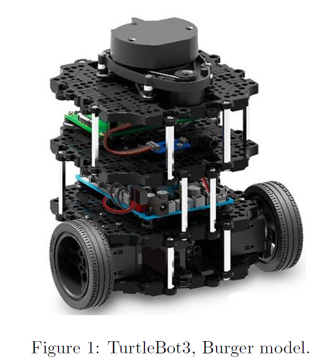
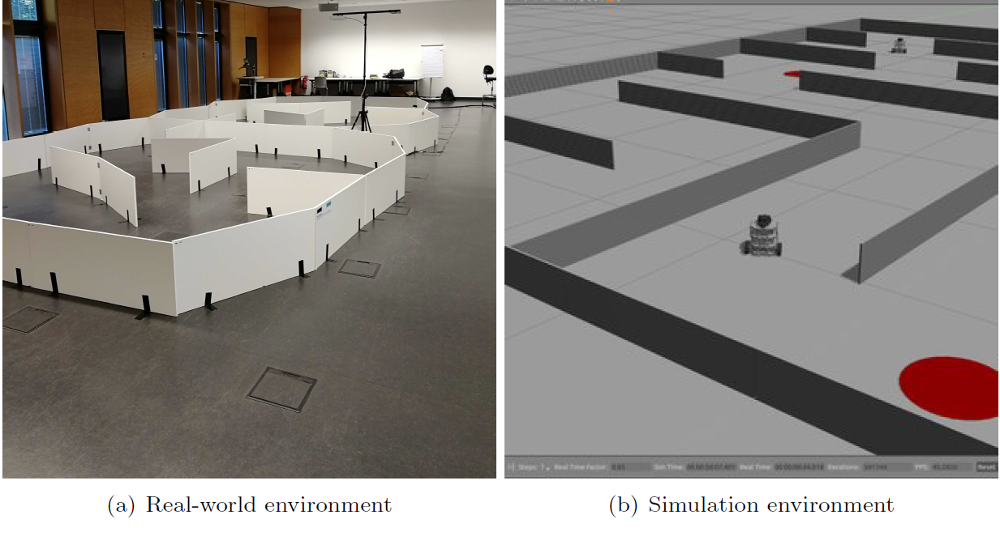

# Project guidelines
### Introduction 
In this course, you will work with the third version of the turtle robot, namely TurtleBot3 Burger. The lab counts ten burger model robots (see Figure 1) to which you will have access during the semester. The TurtleBots can be controlled using the Robot Operating System 2 (ROS2). It is a set of open-source software libraries and tools that help you build robot applications. In addition to the state-of-the-art algorithms ROS2 already provides, you will have to code your own algorithms in Python. Each robot comes with a computer on which all the software you need is installed. Nevertheless, you will probably want to test your code with ROS2 and the simulation environment Gazebo on your own computer as the robots and their computer won't leave the lab. For this, please refer to the **setup** folder of this repository. 

  

The TurtleBots are equipped with a front camera and a LiDAR sensor that gives a 360°-scan of the surrounding environment in a range-and-bearing fashion. In the project of this course, you will use a single robot in a closed environment, where the only obstacles are inert walls. Testing and debugging your code in a real-world setup is a tedious work. For this reason, you will first develop your codes in simulation using Gazebo. We will provide you with the simulating environment. Examples of real-world and simulation environments are shown in Figure 2.

  

### Tasks
The project is done by **group of 3 students**. The goal of the project is to turn a TurtleBot3 into an autonomous pizza delivery driver. The project is divided into two tasks. They are detailed in the following. Note that there are no rules regarding the algorithms and codes you will use for this project as long as you understand what is done and how they work. You will have to motivate the choices you made in the final report and during the oral examination.

#### Task 1 : autonomous environment exploration
In this part of the project, the robot starts in an unknown environment similar to Figure 2, in which ten customers that regularly eat pizzas are scattered. Each of them is represented by an aruco marker giving the corresponding customer's ID number. In this first task, the TurtleBot will have to autonomously:
* build a map of the environment and simultaneously locate itself on it (SLAM);
* identify the customers (aruco markers) and memorize their pose on the map by broadcasting it as a static transform between the map and aruco frames in the [tf2 tree](https://docs.ros.org/en/foxy/Tutorials/Intermediate/Tf2/Introduction-To-Tf2.html).
 
#### Task 2 : pizza delivery
In this task, the robot will receive a list of customers that are craving for pizzas tonight (this list will be a subset of all customers present in the environment). The TurtleBot will have to visit all customers of the list in the order of its choice. The task is fulfilled when all pizzas are delivered. Note that
* the robot should try to minimize its total delivery time (warmer the pizza, bigger the tip);
* for a pizza to be considered delivered, the robot has to make a 3-second stop at approximately 50 cm from the customer;
* it is necessary for the robot to face the customer when delivering the pizza (i.e., the camera should approximately face the aruco marker when the robot makes the stop).

You will be provided with the list of customers' Id's, published as a **std_msgs.msg.Int32MultiArray** message on the ROS2 topic **/delivery_locations**.

### Demonstration
You will have to demonstrate you project in an unknown real-world environment. The D-day will be organized as follows.
* You will arrive **10 minutes before the time slot scheduled** for your demonstration, in order to setup everything and fix the issues you could experience.
* When your scheduled time slot begins, you will have **30 minutes to try your implementation** on the map we prepared. We won't evaluate your work during this period and you are allowed to modify/adapt your code.
* Then, you will have **60 minutes to show us what your robot is able to do**. You will have to discuss the robot's behavior with us. In the sad eventuality that your robot is not able to explore the environment and/or to deliver pizzas, you will have the opportunity to show us working simulations.

 During the demonstration, be prepared to answer questions about general concepts seen in the theoretical course.

### Deliverables
You will have to write a short report of about 5--10 pages describing and motivating your implementation choices. This report should also contain any information you judge relevant. You will also have to provide a zip archive of the workspace that contains your code, as well as a single launch file that launch all the necessary nodes to perform both tasks. The report and the archive should be uploaded on [Gradescope](https://www.gradescope.com/) at least 3 days before your project demonstration.

### Evaluation
Your evaluation for this course will be based on the demonstration of your project in the real-world environment we prepared. Note that the effort you put in the report will also be taken into account. An appreciation will be given at your advantage to the homework you did during the semester.
